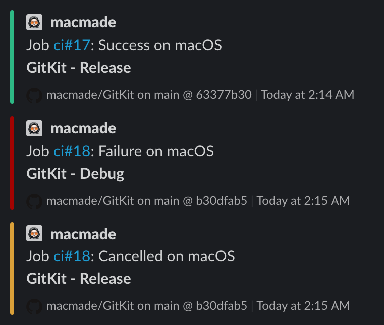

action-slack
============

  

### About

GitHub Action to send Slack notifications.

**Usage**:

    - uses: macmade/actions-slack@v1.0.0

**Inputs**:

  - **channel**: `String`  
    The Slack channel to use for the notifications (eg. `#ci`).
    
  - **status**: `String`  
    The job status: `${{ job.status }}`.
    
  - **title**: `String`  
    A string to use as notification title.
    
  - **text**: `String`  
    An optional string to use as notification message.

**Environment**:

  - **SLACK_WEBHOOK_URL**:  
    The URL of the Slack incloming webhook.
    
**Complete example**:

    name:   test
    on:     [push]
    jobs:
        test:
            runs-on: ubuntu-latest
            steps:
            
                - uses: macmade/action-slack@v1.0.0
                  if:   ${{ always() }}
                  env:
                    SLACK_WEBHOOK_URL:  ${{ secrets.SLACK_WEBHOOK_URL }}
                  with:
                    channel:    '#ci'
                    status:     ${{ job.status }}
                    title:      'hello, world'
                    text:       'This is a test message...'

License
-------

Project is released under the terms of the MIT License.

Repository Infos
----------------

    Owner:          Jean-David Gadina - XS-Labs
    Web:            www.xs-labs.com
    Blog:           www.noxeos.com
    Twitter:        @macmade
    GitHub:         github.com/macmade
    LinkedIn:       ch.linkedin.com/in/macmade/
    StackOverflow:  stackoverflow.com/users/182676/macmade
